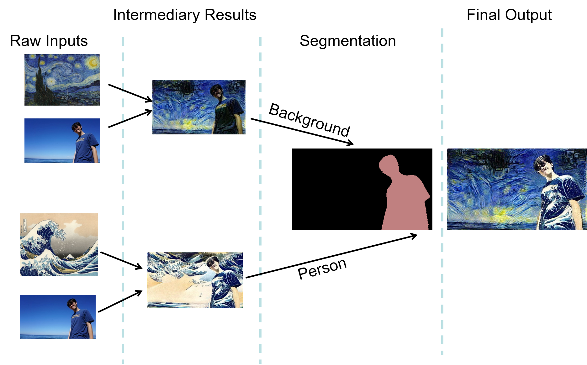

# imagetoart
This is a repository for imagetoart project. Our project is part of the course EEL6761 Cloud Computing and Storage, University of Florida,
fall 2016. 

This project aims to first transfer an input image, which normally contains profile of a person and background, into two pictues with 
different styles. Then it will gernerate a mask from input image. Finally, it will combine those two pictures by mask.

Our implementation is built on [Caffe](http://caffe.berkeleyvision.org/) deep learning library. The current version was developed by 
team CodePlay:

Ruotong Wang
Kirkman Stephen
Xiyuan Gou

# Usage
This is just a primitive version for demo purpose. So for now no usage instruction provided. Second version with usage instructions 
is comming.

# Reference
For the Caffe library, we use a modified version of Caffe:[Caffe supports CRFASRNN](https://github.com/bittnt/caffe/tree/70856cd28a10e2592b4d5ba1ae05cf6b59824a37)

For the style transferring part, we use [Style transfer by fzliu](https://github.com/fzliu/style-transfer)

For the segmentation part, we use [CRF-RNN for Semantic Image Segmentation](https://github.com/torrvision/crfasrnn).
And we modified the source file to cooperate it with style transfer.

For details, you can check the three repository above.
